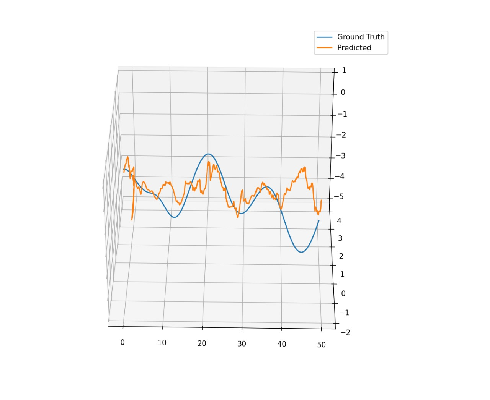
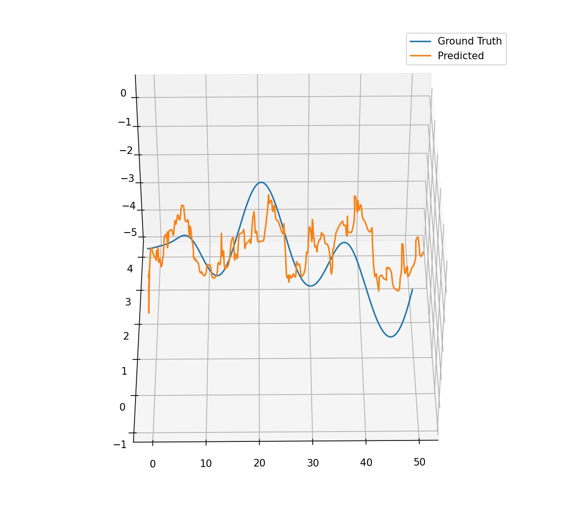
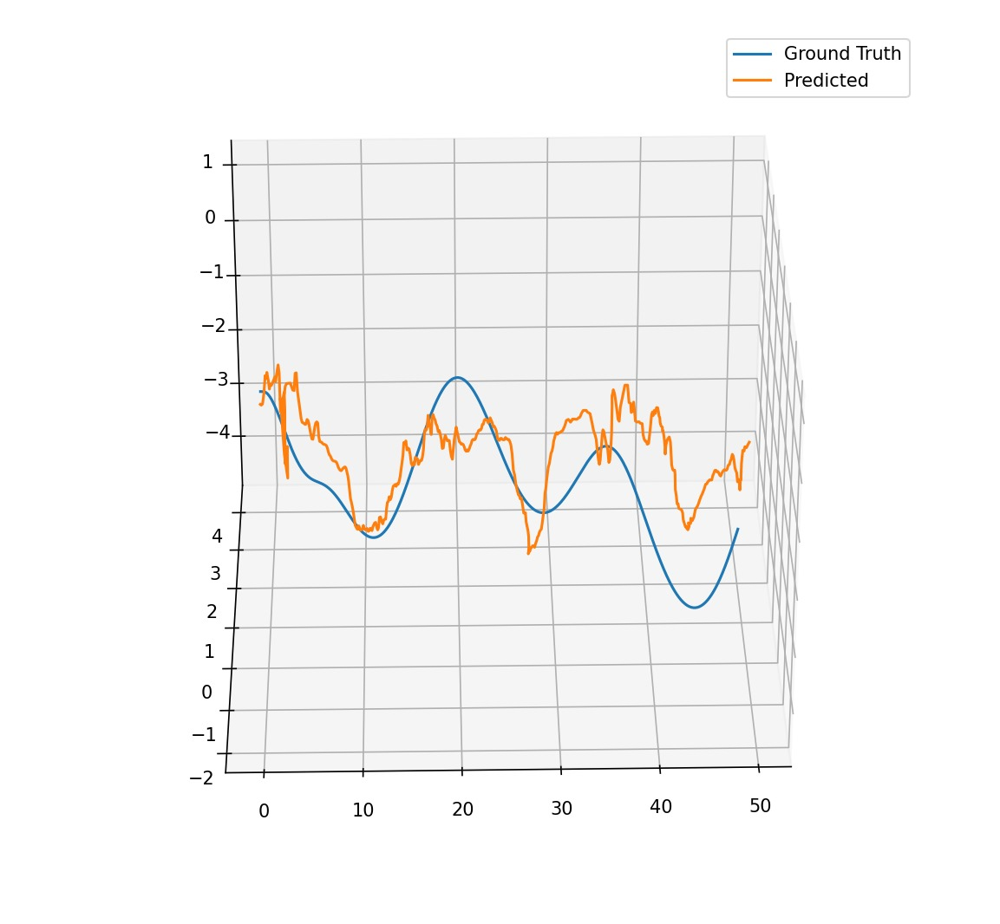
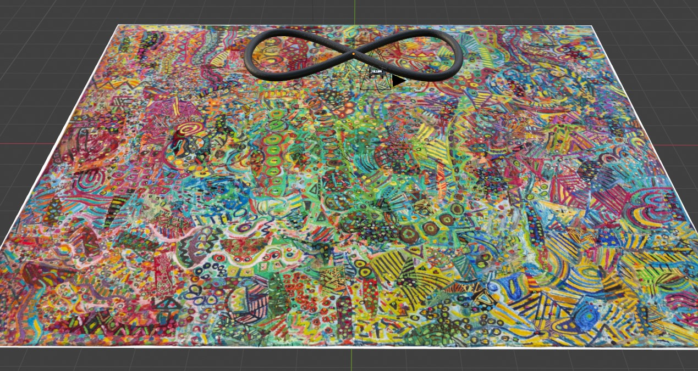

# Deep VIO

## Table of Contents

- [Overview](#overview)
- [Key Features](#key-features)
- [Requirements](#requirements)
- [Usage](#usage)
- [Results](#results)


## Overview
 
This repository contains the code and report for a novel deep learning architecture designed to predict relative camera poses using both visual and inertial sensor data. The project integrates Convolutional Neural Networks (CNNs), Long Short-Term Memory (LSTM) networks, and FlowNet to effectively leverage information from image sequences and inertial measurements. This repository contains code to estimates relative pose from only images, only IMU data and both images and IMU data.

|  | **Position Estimation Results Overview** |  |
|----------|----------|----------|
|  |  |  |
| Visual Odometry  | Inertial Odometry  | Visual-Inertial Odometry  |


| **Sample Trajectory Overview** |  |
|----------|----------|
|  |  |
| Trajectory 1  |  Trajectory 2  |

## Key Features

- **Visual Encoder Net**: Processes image data using CNNs.
- **Inertial Encoder Net**: Processes inertial sensor data using 1D convolutional layers and LSTM.
- **Visual-Inertial Fusion Net**: Combines information from visual and inertial encoders for joint predictions.
- **FlowNet Integration**: Pre-trained on the FlyingChairs dataset for optical flow estimation.
- **Synthetic Data Generation**: Utilizes Blender for creating varied image textures and trajectories.
- **Evaluation Tools**: Includes scripts for visualizing and comparing trajectory results.
- **Optimizers**: Implements AdamW, SGD, and Adam with dynamic learning rate schedules.
- **Future Work**: Outlines potential directions for enhancing model performance and robustness in real-world scenarios.

## Requirements

To run this script, you need Python 3 and the following Python packages:
- `PyTorch`
- `Numpy`
- `Opencv-python`
- `Argparse`
- `Matplotlib`
- `SciPy`
- `Transforms3d`

You can install these packages using pip:

```bash
pip install torch numpy opencv-python argparse matplotlib scipy transforms3d
```

## Usage
1. Clone the repository:

```bash
git clone https://github.com/AbhijeetRathi12/Deep-VIO.git
cd Deep-VIO-main
```

2. To start the training process for Inertial, Visual, and Visual-Inertial network, run the `Train_inertial.py`, `Train_visual.py`, and `Train_VIO.py` script respectively with the desired parameters:

- Inertial Odometry 
```bash
python Code/Train_inertial.py --BasePath ./Data --CheckPointPath ./Checkpoints_Inertial --NumEpochs 300 --MiniBatchSize 15 --LoadCheckPoint 0 --LogsPath ./Logs_Inertial --Split 0.8
```

- Visual Odometry
```bash
python Code/Train_Visual.py --BasePath ./Data --CheckPointPath ./Checkpoints_Visual --NumEpochs 300 --MiniBatchSize 15 --LoadCheckPoint 0 --LogsPath ./Logs_Visual --Split 0.8
```

- Visual Inertial Odometry
```bash 
python Code/Train_VIO.py --BasePath ./Data --CheckPointPath ./Checkpoints_Visual_Inertial --NumEpochs 300 --MiniBatchSize 15 --LoadCheckPoint 0 --LogsPath ./Logs_Visual_Inertial --Split 0.8
```
### Arguments  

- `--BasePath`: Base path of images and data  
- `--CheckPointPath`: Path to save checkpoints  
- `--NumEpochs`: Number of epochs to train  
- `--MiniBatchSize`: Size of the minibatch  
- `--LoadCheckPoint`: Load model from latest checkpoint  
- `--LogsPath`: Path to save logs  
- `--Split`: Train-validation split ratio  

3. To the test Inertial, Visual, and Visual-Inertial model, run the `Test_inertial.py`, `Test_visual.py`, and `Test_VIO.py` script respectively with the desired parameters:

- Inertial Odometry 
```bash
python Code/Test_inertial.py --BasePath ./Data --CheckPointPath ./Checkpoints_Inertial --MiniBatchSize 15 --LoadCheckPoint 0
```

- Visual Odometry
```bash
python Code/Test_Visual.py --BasePath ./Data --CheckPointPath ./Checkpoints_Visual --MiniBatchSize 15 --LoadCheckPoint 0
```

- Visual Inertial Odometry
```bash 
python Code/Test_VIO.py --BasePath ./Data --CheckPointPath ./Checkpoints_Visual_Inertial --MiniBatchSize 15 --LoadCheckPoint 0
```
### Arguments  

- `--BasePath`: Base path of images and data  
- `--CheckPointPath`: Path to save checkpoints  
- `--MiniBatchSize`: Size of the minibatch  
- `--LoadCheckPoint`: Load model from latest checkpoint  


## Results
After training, the loss metrics are plotted and saved in the checkpoint path. The plots showing the training and validation loss over iterations and epochs can be found in **[Report.pdf](./Report.pdf)**.


